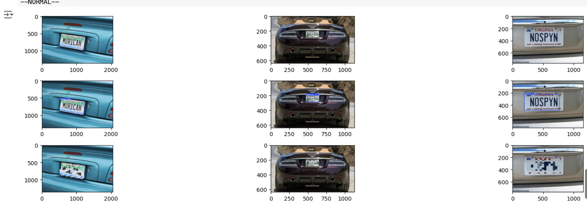

# License Plate Censor API

## Tech use

- Pytorch
- Yolov5
- Docker
- Flask

`detect.py`: main plate detector logic

- count tracks
- detect and mark license plate
- recognize the text on the license plate [not yet]

